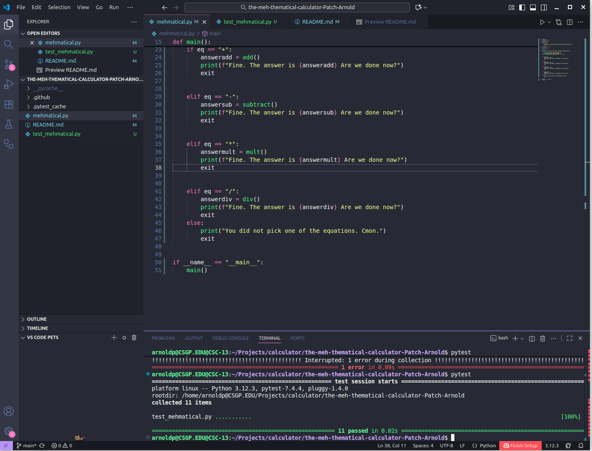

   
# 📘 Mehmatical Calculator
A very bored assistant, who helps you with a grudge.

# 🧠 About
A Calculator with an attitude, can multiply, divide, add and subtract

Tests have been ran using pytest, accessible on the test_mehmatical.py page, can be run by typing pytest into the terminal.

# 🚀 Installation
## Clone the repository
git clone https://github.com/WTCSC/the-meh-thematical-calculator-Patch-Arnold.git

## Go into the project directory
python3 mehmatical.py

# 🖼️ Screenshots

# 📄 License
This project is licensed under the MIT License.
 Or choose another license appropriate for your project.

# 📬 Contact
Patch Arnold
Email: pumkinpatch9210@gmail.com

GitHub: @Patch-Arnold

LinkedIn: https://www.linkedin.com/in/patch-arnold-a79522386/ 

